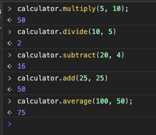

# JavaScript-OOP-1

### Exercise

1. Read about **methods** on [MDN](https://developer.mozilla.org/en-US/docs/Web/JavaScript/Reference/Functions/Method_definitions)
1. Read pages 32 and 101 in _JavaScript and jQuery_ by Duckett.
1. Create an `index.html` and add a basic [HTML Skeleton](../html-skeleton/README.md).

1. Add a `<script>` tag at bottom of your `<body>`

1. Your task is to create an object to replicate the outcome in the screenshot below:

    

      
    

1. Create an object literal named calculator with the following methods:

    -  multiply
        -  Takes two arguments
        -  Returns the result of the arguments being multiplied together

    -  divide
        -  Takes two arguments
        -  Returns the result of the arguments being divided into each other

    -  add
        -  Takes two arguments
        -  Returns the result of the arguments being added together

    -  subtract
        -  Takes two arguments
        -  Returns the result of the arguments being subtracted

    -  average
        -  Takes two arguments
        -  Returns the average of the two arguments
        -  **Bonus Requirement**:
            Use the add and divide methods on this object to get the result.  Make sure to also use the `this` keyword.

